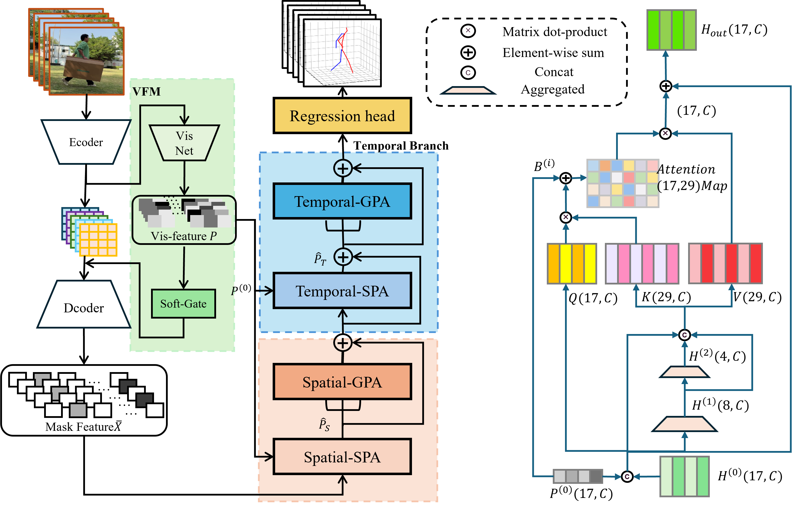
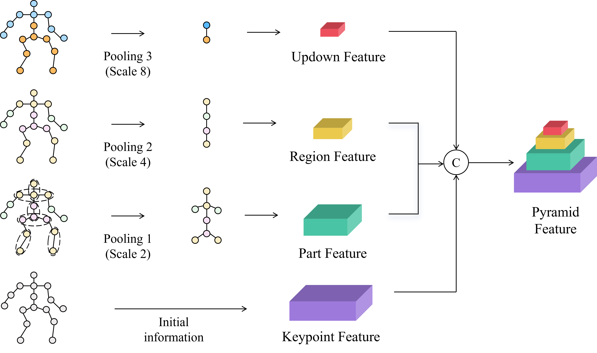
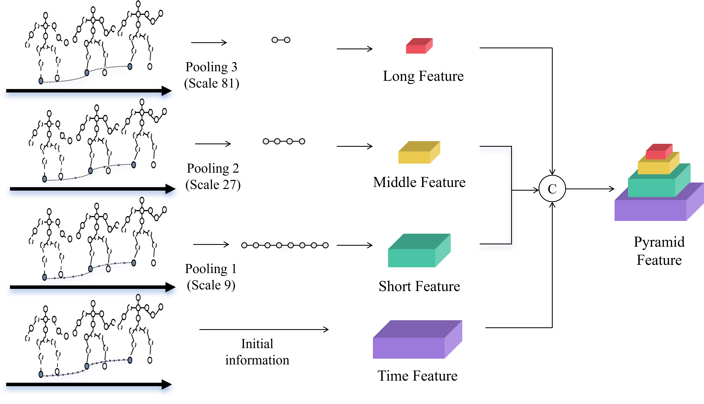
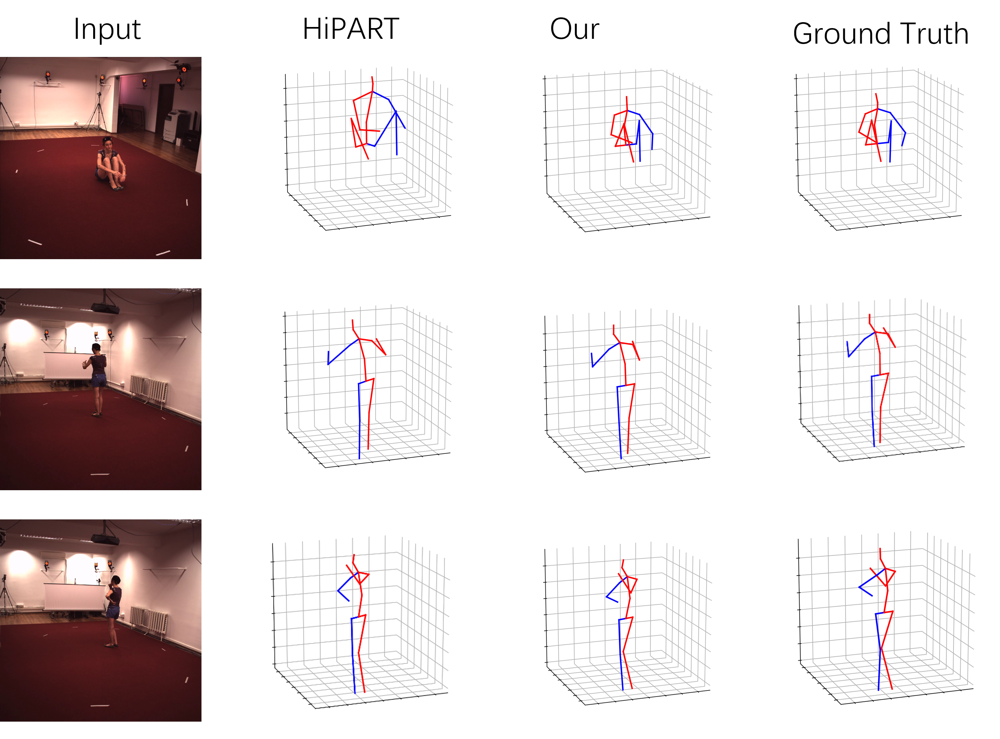
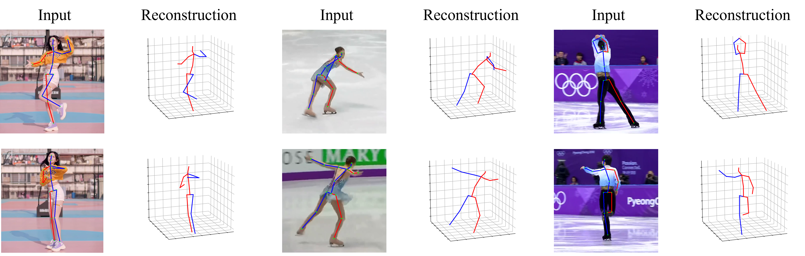

# PICFormer: Visibility-Aware 3D Human Pose Estimation

This is a Transformer-based 3D human pose estimation project implementing the PICFormer (Pose-aware Interactive Cross-modal Transformer) model.

## Architecture Overview

PICFormer introduces a novel closed-loop architecture that unifies Perception, Inference, and Constraints. The model consists of a Visibility-Aware Feature Modulation (VFM) module and a Gated-Pyramid Attention (GPA) Module, which leverages synchronized pyramidal aggregation (SPA).


*Figure 1: The overall network architecture of PICFormer.*

## Key Mechanisms: Synchronized Pyramidal Aggregation (SPA)

At the core of PICFormer is the SPA module, which builds a multi-scale spatio-temporal feature hierarchy. This allows the model to use high-level semantics to guide low-level occlusion reasoning. The pyramid structure is constructed for both spatial (joints, parts, regions) and temporal (frames, clips, sequences) domains.




*Figure 2: Diagram illustrating the pooling strategy and construction of the spatio-temporal pyramid structure.*


## Results

### Qualitative Results

PICFormer demonstrates robust and reliable performance in complex actions, often producing pose estimations that are closer to the ground truth than other state-of-the-art methods.


*Figure 3: Qualitative comparisons on the Human3.6M dataset against HiPART. Our model's predictions are visibly closer to the ground truth.*

### Generalization to In-the-Wild Scenarios

Although trained solely on the Human3.6M dataset, PICFormer generalizes effectively to various unseen in-the-wild scenarios, including sports and dance.


*Figure 4: Visualization of performance on various challenging in-the-wild scenarios.*


## Project Features

- **Visibility-Aware Module (VFM)**: Automatically detects and utilizes keypoint visibility information
- **Spatial-Temporal Aggregation Module (SPA)**: Multi-scale spatial and temporal feature aggregation
- **Global Position-Aware Module (GPA)**: Attention-based global position awareness
- **End-to-End Training**: Supports end-to-end training from 2D keypoints to 3D poses
- **Multi-Dataset Support**: Supports Human36M, 3DPW and other datasets

## Project Structure

```
picformer_project/
├── README.md                 # Project description
├── requirements.txt          # Dependency list
├── setup.py                  # Installation script
├── config/
│   └── config.yaml          # Configuration file
├── data/
│   ├── raw/                 # Raw data
│   └── processed/           # Processed data
├── src/
│   ├── __init__.py
│   ├── config.py            # Configuration management
│   ├── datasets.py          # Dataset loading
│   ├── utils.py             # Utility functions
│   ├── train.py             # Training script
│   ├── evaluate.py          # Evaluation script
│   ├── infer.py             # Inference script
│   └── models/
│       ├── __init__.py
│       ├── vfm.py           # Visibility-aware module
│       ├── spa.py           # Spatial-temporal aggregation module
│       ├── gpa.py           # Global position-aware module
│       └── picformer.py     # Main model
├── scripts/
│   ├── train.sh             # Training script
│   ├── evaluate.sh          # Evaluation script
│   └── infer.sh             # Inference script
└── tests/
    └── test_models.py       # Model tests
```

## Installation

1. Clone the project
```bash
git clone <repository-url>
cd picformer_project
```

2. Install dependencies
```bash
pip install -r requirements.txt
pip install -e .
```

## Usage

### 1. Data Preparation

Place datasets in the `data/processed/` directory, supporting the following formats:
- Human36M: `h36m_train.h5`, `h36m_val.h5`
- 3DPW: `3dpw_val.h5`

Data format:
- `poses_2d`: 2D keypoints [N, T, J, 2]
- `poses_3d`: 3D keypoints [N, T, J, 3]
- `visibility`: Visibility labels [N, T, J]

### 2. Training

```bash
# Use script for training
bash scripts/train.sh

# Or run Python script directly
python src/train.py --config config/config.yaml --checkpoint checkpoint
```

### 3. Evaluation

```bash
# Use script for evaluation
bash scripts/evaluate.sh

# Or run Python script directly
python src/evaluate.py --config config/config.yaml --checkpoint checkpoint
```

### 4. Inference

```bash
# Use script for inference
bash scripts/infer.sh data/input_poses.npy output/results.npz

# Or run Python script directly
python src/infer.py --input data/input_poses.npy --output output/results.npz --checkpoint checkpoint/best.pth
```

### 5. Testing

```bash
python tests/test_models.py
```


## Configuration

Main configuration parameters in `config/config.yaml`:

