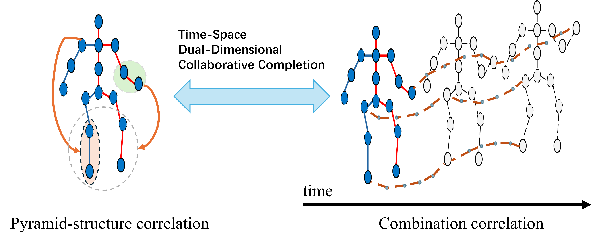
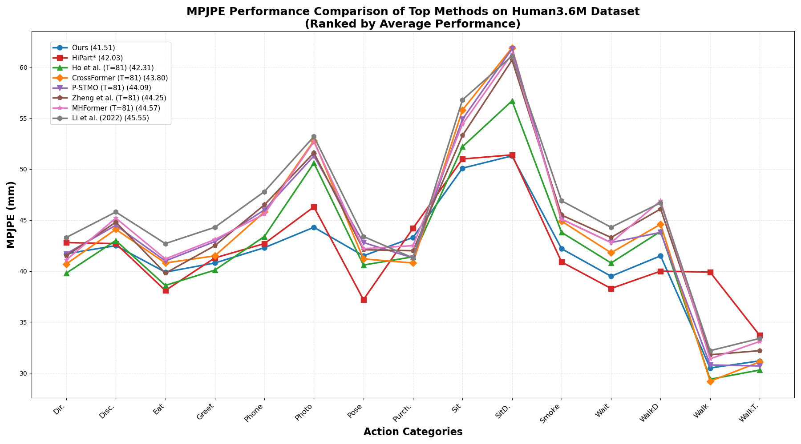
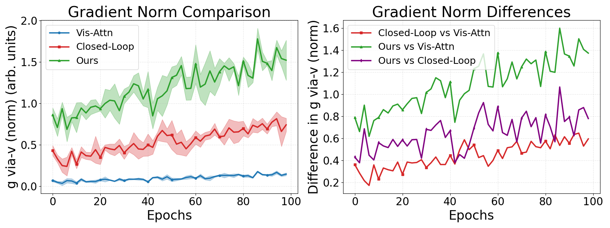
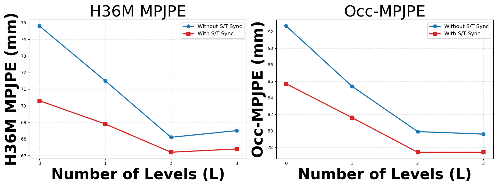

# PICFormer: Visibility-Aware 3D Human Pose Estimation

This is a Transformer-based 3D human pose estimation project implementing the PICFormer (Pose-aware Interactive Cross-modal Transformer) model.

## Core Concept: Spatio-Temporal Modeling

PICFormer is built on a foundation of dual-dimensional collaborative completion. The model learns pyramid-structured spatial correlations within a single frame and combines them with temporal correlations across multiple frames. This alternate stacking of spatial and temporal information improves the modeling of sequence coherence.


*Figure: High-level overview of the spatio-temporal correlation modeling in PICFormer.*

## Architecture Overview

PICFormer introduces a novel closed-loop architecture that unifies Perception, Inference, and Constraints. The model consists of a Visibility-Aware Feature Modulation (VFM) module and a Gated-Pyramid Attention (GPA) Module, which leverages synchronized pyramidal aggregation (SPA).


*Figure 1: The overall network architecture of PICFormer.*

## Key Mechanisms: Synchronized Pyramidal Aggregation (SPA)

At the core of PICFormer is the SPA module, which builds a multi-scale spatio-temporal feature hierarchy. This allows the model to use high-level semantics to guide low-level occlusion reasoning. The pyramid structure is constructed for both spatial (joints, parts, regions) and temporal (frames, clips, sequences) domains.

<div style="display: flex; justify-content: center; gap: 20px;">
  
  
</div>

*Figure 2: Diagram illustrating the pooling strategy and construction of the spatio-temporal pyramid structure.*


## Results

### Quantitative Results on Human3.6M

Our model sets a new state-of-the-art on the Human3.6M benchmark. The graph below shows a detailed comparison of Mean Per-Joint Position Error (MPJPE) against other top-performing methods across all major action categories, illustrating the consistent performance advantage of our approach.


*Figure: Per-action MPJPE comparison on the Human3.6M dataset, ranked by average performance.*

### Qualitative Results

PICFormer demonstrates robust and reliable performance in complex actions, often producing pose estimations that are closer to the ground truth than other state-of-the-art methods.


*Figure 3: Qualitative comparisons on the Human3.6M dataset against HiPART. Our model's predictions are visibly closer to the ground truth.*

### Generalization to In-the-Wild Scenarios

Although trained solely on the Human3.6M dataset, PICFormer generalizes effectively to various unseen in-the-wild scenarios, including sports and dance.


*Figure 4: Visualization of performance on various challenging in-the-wild scenarios.*

### Analysis of the Closed-Loop Feedback

The core innovation of PICFormer is its closed-loop feedback mechanism. We analyzed the gradient norm flowing back to the encoder via the visibility gate to validate this design. The results clearly show that our method (green) sustains a significantly stronger gradient signal compared to baseline models. This confirms that the feedback loop actively supplies meaningful corrective signals throughout training, which is key to the performance gains we observe.


*Figure: Analysis of gradient norms shows that our closed-loop design with hierarchical consistency ("Ours") provides a stronger and more effective feedback signal.*

### Ablation Study: SPA Depth and Synchronization

We performed an ablation study to determine the optimal configuration for the SPA module. As shown below, enabling Spatio-Temporal (S/T) Synchronization consistently reduces MPJPE, with the benefits being even more pronounced in occluded scenarios. While performance improves with more pyramid levels, the gains saturate after L=2, making it the most efficient and effective choice for our final model.


*Figure: Ablation results for SPA depth (L) and S/T synchronization on the H36M and Occ-H36M datasets.*

## Project Features

- **Visibility-Aware Module (VFM)**: Automatically detects and utilizes keypoint visibility information
- **Spatial-Temporal Aggregation Module (SPA)**: Multi-scale spatial and temporal feature aggregation
- **Global Position-Aware Module (GPA)**: Attention-based global position awareness
- **End-to-End Training**: Supports end-to-end training from 2D keypoints to 3D poses
- **Multi-Dataset Support**: Supports Human36M, 3DPW and other datasets

## Project Structure

```
picformer_project/
├── README.md                 # Project description
├── requirements.txt          # Dependency list
├── setup.py                  # Installation script
├── config/
│   └── config.yaml          # Configuration file
├── data/
│   ├── raw/                 # Raw data
│   └── processed/           # Processed data
├── src/
│   ├── __init__.py
│   ├── config.py            # Configuration management
│   ├── datasets.py          # Dataset loading
│   ├── utils.py             # Utility functions
│   ├── train.py             # Training script
│   ├── evaluate.py          # Evaluation script
│   ├── infer.py             # Inference script
│   └── models/
│       ├── __init__.py
│       ├── vfm.py           # Visibility-aware module
│       ├── spa.py           # Spatial-temporal aggregation module
│       ├── gpa.py           # Global position-aware module
│       └── picformer.py     # Main model
├── scripts/
│   ├── train.sh             # Training script
│   ├── evaluate.sh          # Evaluation script
│   └── infer.sh             # Inference script
└── tests/
    └── test_models.py       # Model tests
```

## Installation

### Requirements

- Python 3.8+
- PyTorch 1.10.0+
- CUDA 11.0+ (for GPU training)

### Step-by-Step Installation

1. **Clone the repository**
```bash
git clone <repository-url>
cd picformer_project
```

2. **Create a virtual environment (recommended)**
```bash
# Using conda
conda create -n picformer python=3.8
conda activate picformer

# Or using venv
python -m venv picformer_env
source picformer_env/bin/activate  # On Windows: picformer_env\Scripts\activate
```

3. **Install PyTorch**
```bash
# For CUDA 11.8
pip install torch torchvision torchaudio --index-url https://download.pytorch.org/whl/cu118

# For CPU only
pip install torch torchvision torchaudio --index-url https://download.pytorch.org/whl/cpu
```

4. **Install other dependencies**
```bash
pip install -r requirements.txt
```

5. **Install the package in development mode**
```bash
pip install -e .
```

### Verify Installation

```bash
python -c "import torch; print('PyTorch version:', torch.__version__)"
python -c "import src.models.picformer; print('PICFormer installed successfully')"
```

## Usage

### Model Weights

Pre-trained model weights will be released soon. Once available, download the model weights and place them in the `checkpoint/` directory:

```bash
# Create checkpoint directory
mkdir -p checkpoint

# Download pre-trained weights (links will be provided upon acceptance)
# wget <model-weights-url> -O checkpoint/picformer_h36m.pth
```

### Quick Start

#### 1. Inference with Pre-trained Model

```bash
# Basic inference on 2D keypoints
python src/infer.py \
    --input data/input_poses.npy \
    --output results/output_3d.npz \
    --checkpoint checkpoint/picformer_h36m.pth \
    --config config/config.yaml

# Inference with custom settings
python src/infer.py \
    --input data/input_poses.npy \
    --output results/output_3d.npz \
    --checkpoint checkpoint/picformer_h36m.pth \
    --config config/config.yaml \
    --batch_size 32 \
    --device cuda:0
```

#### 2. Training from Scratch

```bash
# Using the provided training script
bash scripts/train.sh

# Or run training directly with custom parameters
python src/train.py \
    --config config/config.yaml \
    --output_dir experiments/picformer_experiment \
    --epochs 200 \
    --lr 1e-4 \
    --batch_size 64
```

#### 3. Evaluation

```bash
# Evaluate on test set
bash scripts/evaluate.sh

# Or evaluate with specific checkpoint
python src/evaluate.py \
    --config config/config.yaml \
    --checkpoint checkpoint/picformer_h36m.pth \
    --dataset_name h36m \
    --subset test
```

#### 4. Custom Training Configuration

```bash
# Train with custom configuration
python src/train.py \
    --config config/config.yaml \
    --model.channel 256 \
    --train.lr 5e-5 \
    --train.weight_decay 0.01 \
    --loss.lambda_vis 0.2 \
    --output_dir experiments/custom_run
```

### Testing the Installation

```bash
# Run unit tests
python -m pytest tests/ -v

# Test model loading
python tests/test_models.py

# Quick functionality test
python -c "
from src.models.picformer import PICFormer
from src.config import load_config
config = load_config('config/config.yaml')
model = PICFormer(config)
print(f'Model loaded successfully with {sum(p.numel() for p in model.parameters())} parameters')
"
```


## Configuration

Main configuration parameters in `config/config.yaml`:

